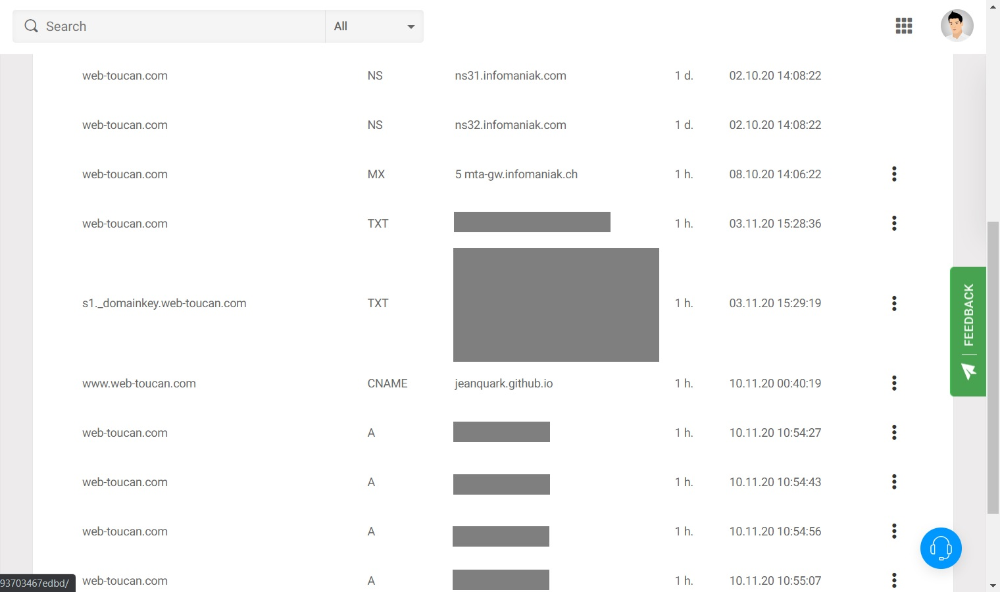

# web-toucan

A <a href="https://nuxtjs.org/" target="_blank">Nuxt.js</a> static website. Includes contact form and auto deployment to GitHub Pages on every push to master branch through GitHub Actions.


## Build Setup

```bash
# install dependencies
$ npm install

# serve with hot reload at localhost:3000
$ npm run dev
```

## Contact form configuration

Sending emails from static websites is not as straightforward as with server-based sites. It is necessary to make use of third party functions. In this case, we use <a href="https://github.com/dwyl/learn-to-send-email-via-google-script-html-no-server" target="_blank">Google Apps Mail</a> which allows sending emails from any static HTML page. Messages are saved in a Google spreadsheet <a href="https://docs.google.com/spreadsheets/d/1LyC2WLXFU7_dV3WaLXtHP99vUANa6UL0qQFL0aD0fYs/edit#gid=0">here</a>.

## Routes configuration

```js
// nuxt.config.js
const routerBase =
    process.env.DEPLOY_ENV === 'GH_PAGES'
        ? {
              router: {
                  base: '/web-toucan/' // Deployment on jeanquark.github.io/web-toucan
                  // base: '/' Deployment on custom domain
              }
          }
        : {}
```
## DNS config




## Author

<a href="https://jmkleger.com" target="_blank">Jean-Marc Kleger</a>
